# Handoff: 프롬프트 아레나 (Prompt Arena) — MVP

AI 프롬프트 경진대회 서비스의 하이파이 프로토타입 핸드오프 패키지입니다. 이 문서 하나로 디자인 의도를 코드베이스에 옮길 수 있도록 작성했습니다.

---

## Overview

**프롬프트 아레나**는 "3일 챌린지 + 블라인드 투표"를 엔진 삼아, 검증된 AI 프롬프트를 카테고리별로 누적하는 모바일 웹 서비스입니다. MVP의 일은 *검색·수익화*가 아니라 그 아카이브의 **재료를 쌓는 엔진(챌린지 + 투표)**을 작동시키는 것입니다.

핵심 메커니즘:
- 한 사용자는 한 챌린지에서 프롬프트를 **최대 5회 생성**(각 = Gemini 1회 실행)하고 그중 **1개를 제출**합니다. **제출은 확정 잠금**(수정·삭제 불가).
- 챌린지는 **제출 → 투표 → 결과** 페이즈로 시간에 따라 분리됩니다. **상태는 저장하지 않고 4개 시각 + 서버 현재 시각으로 계산**합니다.
- 투표는 **블라인드**(결과물만, 프롬프트·작성자·득표 가림), 챌린지당 **최대 3표**. **3표를 다 쓰면 그 챌린지 전체 프롬프트 열람이 해제**됩니다.

전체 제품 정의·근거·데이터 모델·일정은 동봉한 `prompt-arena-prd.md`(PRD)에 있습니다. 이 README는 그 PRD를 **디자인 관점에서 구현 가능하게** 풀어쓴 문서입니다. 충돌 시 PRD의 정책이 우선이고, 비주얼/레이아웃은 이 README와 HTML 파일이 기준입니다.

---

## About the Design Files

`design_files/` 안의 파일들은 **HTML/CSS/React(JSX)로 만든 디자인 레퍼런스**입니다 — 의도한 모양과 동작을 보여주는 프로토타입이지, 그대로 가져다 쓸 프로덕션 코드가 **아닙니다**.

- 브라우저 내장 Babel + CDN React로 돌아가는 단일 페이지 데모이며, 모든 화면을 한 "하니스(harness)"에서 점프·비교할 수 있게 만든 것입니다. 실제 라우팅·상태·서버 로직은 없습니다(클릭으로 흐름만 시연).
- **할 일은 이 HTML 디자인을 타깃 코드베이스의 환경(PRD 기준 React + Vite/Next 류, Supabase, Vercel)에서 그 코드베이스의 패턴·라이브러리로 다시 구현하는 것**입니다. 환경이 아직 없다면 PRD의 기술 스택(§12.4)에 맞춰 적절한 프레임워크를 고르세요.
- 디자인 토큰(색·타이포·간격)은 `design_files/colors_and_type.css`에 plain CSS custom properties로 들어 있습니다. 컴포넌트 스타일은 `design_files/arena.css`에 있습니다. 이 둘은 그대로 베껴도 좋은 **값의 출처**입니다.

### 데모 실행 방법
`design_files/arena.html`을 브라우저에서 열면 됩니다(별도 빌드 불필요, 인터넷 연결 필요 — React/Babel CDN). 왼쪽 **레일(rail)**에서:
- 사용자 앱 / 관리자 화면을 아무거나 점프
- **서버 상태**(제출/투표/결과/공백)를 바꿔 첫 화면 4뷰 분기 확인
- **강조 색** 스와치(tangerine / violet / **sky**)와 **설계 주석 표시** 토글
- create/vote/result 화면에서 **A/B/C 레이아웃 변형** 전환

---

## Fidelity

**High-fidelity (hifi).** 최종 색상·타이포·간격·상태(hover/focus/disabled)·인터랙션까지 담은 픽셀 단위 목업입니다. 개발자는 코드베이스의 기존 라이브러리·패턴으로 **이 UI를 픽셀 단위로 재현**하면 됩니다. 단, 다음은 *데모용 장치*이므로 프로덕션에는 옮기지 마세요:
- 왼쪽 **레일/스테이지 하니스** 전체 (화면 점프·상태 토글·변형 토글·주석 토글) — 디자인 탐색 도구일 뿐입니다.
- **폰 베젤(.phone)·맥OS 타이틀바(.titlebar)** — 디바이스 목업 프레임이며 실제 앱 크롬이 아닙니다.
- create/vote/result의 **A/B/C 변형**은 *탐색용 후보*입니다. 아래 "Variants & decisions needed"에서 어느 것을 채택할지 결정해야 합니다.

> **강조 색 결정:** 이 패키지는 강조 색을 **sky(파란색 계열, hb-kit의 `tertiary` 램프)**로 기본 설정해 핸드오프합니다. `arena.html`의 `<body data-accent="sky">`와 `app.jsx`의 `useState("sky")`가 그 기본값입니다. 모든 강조 표면은 CSS 변수 `--acc-*`로 간접 참조되므로, 강조 색은 `data-accent` 한 곳만 바꾸면 전체가 따라옵니다.

---

## Screenshots

데모(`arena.html`)에서 캡처한 화면 참조입니다. `screens/` 폴더에 원본 PNG가 들어 있습니다. **모두 강조 색 = sky, A안 기준**입니다. (디바이스 베젤은 목업 프레임이며 실제 앱 크롬이 아닙니다.)

### 첫 화면 — 상태별 분기
| 제출 기간 | 투표 기간 | 결과 기간 |
|---|---|---|
| 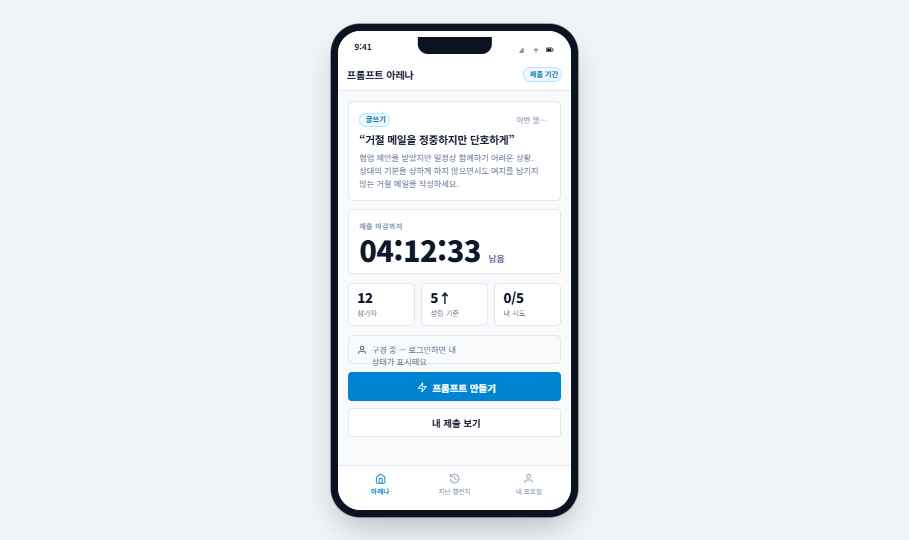 | 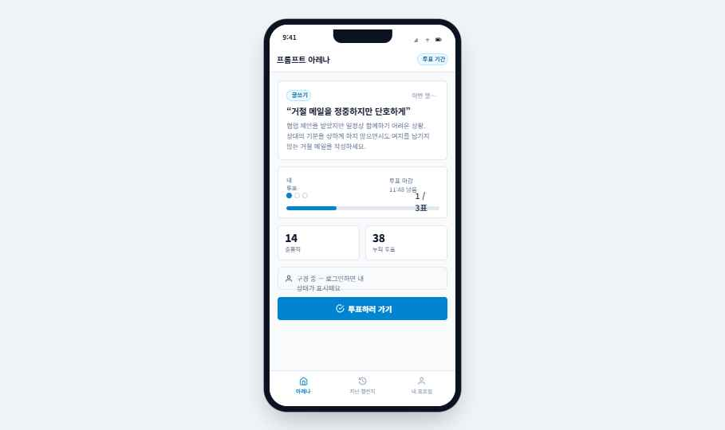 | 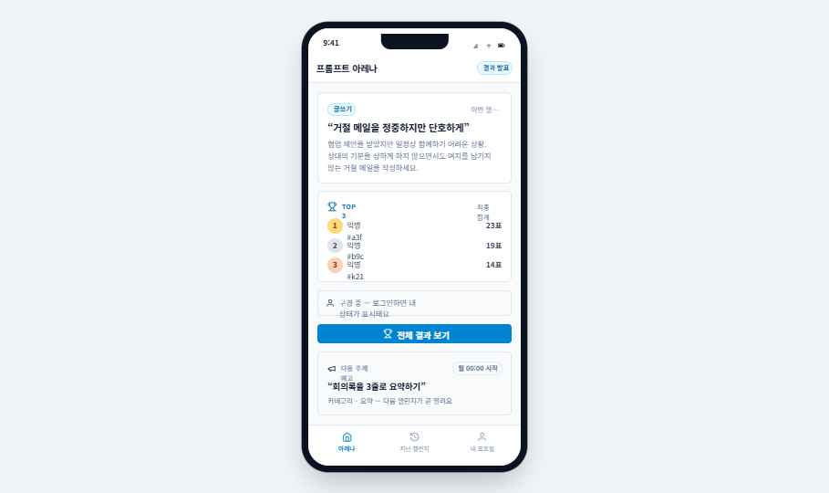 |

### 핵심 플로우 (채택 A안)
| 프롬프트 생성 | 투표 (블라인드 피드) | 결과 (시상대) |
|---|---|---|
| 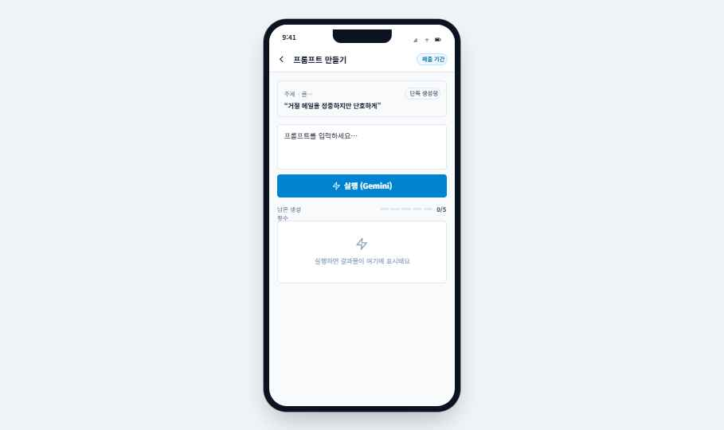 | 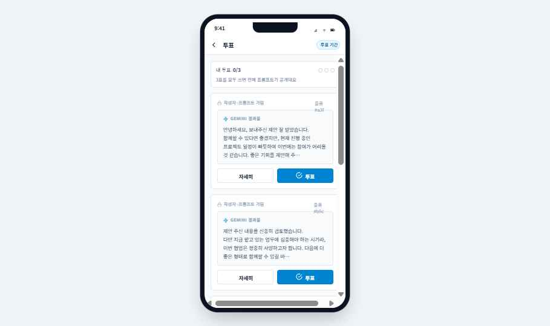 | 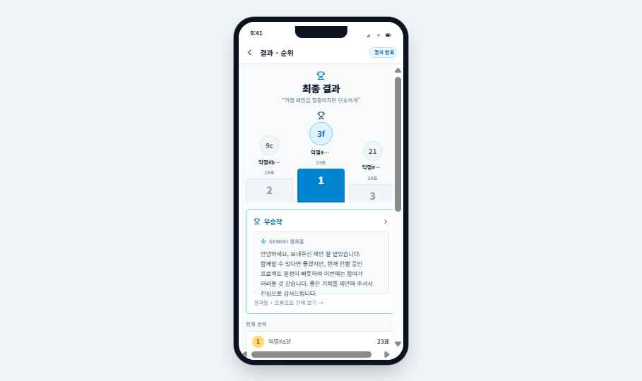 |

### 부가 화면
| 출품작 상세 | 로그인 게이트 | 내 프로필 |
|---|---|---|
| 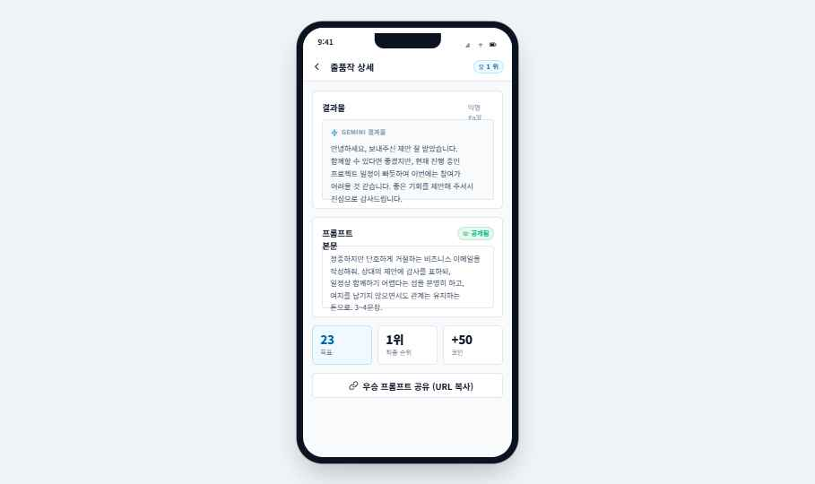 | 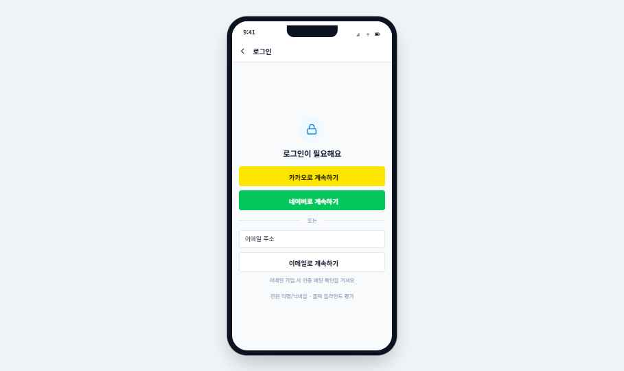 | 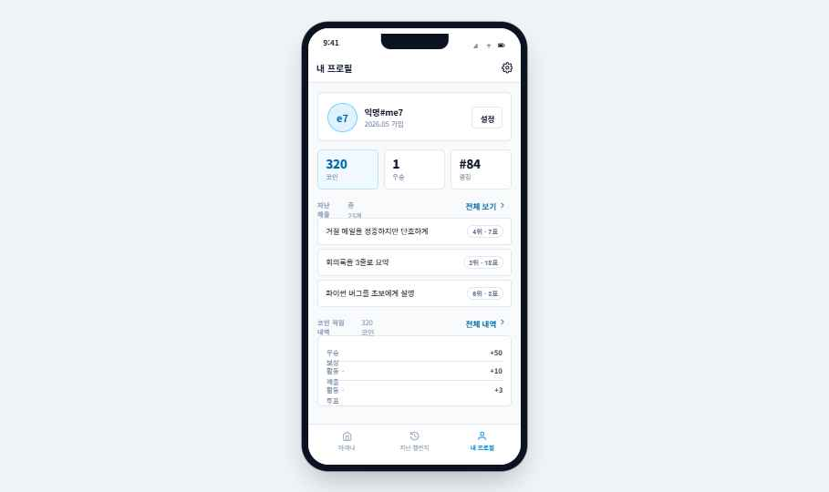 |

### 관리자 (데스크톱)
| 대시보드 | 챌린지 출제 |
|---|---|
| 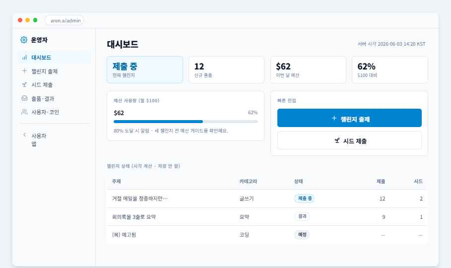 | 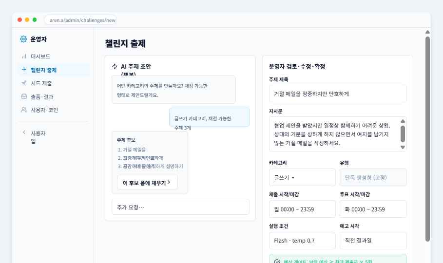 |

> 더 정확한 인터랙션·상태 전환은 `arena.html`을 직접 열어 레일에서 화면·서버 상태를 바꿔가며 확인하세요.

---

전체 화면 목록과 역할은 PRD §8에 있습니다. 아래는 **레이아웃·컴포넌트·카피**를 구현 가능 수준으로 기술합니다. 정확한 마크업은 괄호 안 파일을 참조하세요.

### 사용자 앱 (모바일 웹 우선, 디자인 폭 370px 화면)

모든 사용자 화면은 공통 셸을 공유합니다:
- **상태바**(44px): 시각 `9:41` + 신호/와이파이/배터리 아이콘. 배경 흰색.
- **앱바(.appbar, 52px)**: 좌측 뒤로가기(필요 시) + 타이틀 + 우측 액션. 하단 1px `--color-border` 경계.
- **스크롤 본문(.scroll)**: padding 16px, 세로 flex, gap 14px.
- **탭바(.tabbar)**: 최상위 화면(첫 화면·지난 챌린지·내 프로필)에서만 노출. 아이콘 21px + 10.5px 라벨, 활성 탭은 강조색.

#### 1. 첫 화면 / 진행 중 챌린지 (`home.jsx`)
- **목적:** 모든 행동의 입구. "지금 이 챌린지에 참여하라". 목록형이 아니라 **진행 중 챌린지 하나**를 크게.
- **상태별 4뷰 분기** (현재 서버 시각 기준 — 데모에선 레일의 "서버 상태"로 전환):
  - **제출 기간:** 카테고리 칩(예 "글쓰기") + 챌린지 제목(큰 22px/800, 인용부호 포함 예: "거절 메일을 정중하지만 단호하게") + 지시문(muted 본문) + 카운트다운 카드("제출 마감까지 04:12:33 남음", 38px/800 tabular-nums) + 통계 3개(참가자 수 / 선착 기준 / 내 시도 0/5) + 주 CTA `[프롬프트 만들기]`(primary, 풀폭 46px) + 보조 `[내 제출 보기]`.
  - **투표 기간:** 제목 + 출품작 리스트(결과물만, 블라인드) + 내 투표 상태 토큰(N/3 pip) + 주 CTA `[투표하러 가기]`.
  - **결과 기간/종료 후:** 제목 + 최종 순위/우승작 + 전체 프롬프트 공개 안내 + 주 CTA `[결과 보기]`.
  - **공백(일요일 등):** "진행 중 챌린지 없음" → `[지난 결과 보기]`.
- **페이즈 스트립(.phasestrip):** 제출 → 투표 → 결과를 점(pdot)으로 표시. 완료=emerald, 현재=강조색+후광 링, 예정=neutral.
- **로그인/비회원 분기:** 비회원도 주제·출품작·결과 구경 가능. `[만들기]/[제출]/[투표]`를 누르면 로그인 게이트. 로그인 사용자에게만 "내 상태"가 얹힘. 스테이지 상단 칩으로 "로그인됨/비회원" 표시.

#### 2. 프롬프트 생성 화면 (`flow.jsx` — `CreateScreen`)
- **목적:** 가장 공들이고 *돈이 나가는* 화면. 입력 → Gemini 실행 → 결과 확인을 5회까지.
- **구성:** 주제 표시 + 프롬프트 입력(textarea, .input.textarea, min-height 90px) + `[실행]` + 결과물 박스(.output, 라벨 "결과물" + Gemini 아이콘 강조색) + **남은 횟수 N/5**(.genpips — 18×5px 막대 5개, 사용분은 강조색) + 재시도 + 제출 선택.
- **상태:** 실행 로딩(수 초 소요 가능, 명확한 로딩 표시), 5회 소진 시 생성 잠금. *실행 실패는 횟수 차감 안 함. 성공했으나 불만족은 차감.*
- **변형(A/B/C):** A=단일+히스토리, B=비교 캐러셀, C=채팅 스레드. (아래 결정 필요.)

#### 3. 제출 확정 모달 (`flow.jsx` — `SubmitModal`)
- **바텀시트(.sheet)**: 하단에서 슬라이드 업(240ms, `--ease-spring`), 상단 grab 핸들, 반투명 오버레이(rgba(15,23,42,0.45)).
- **카피:** "제출하면 수정·삭제할 수 없어요. 계속할까요?" + 선택한 결과물 미리보기 + `[제출 확정]`(primary) / `[취소]`(ghost).
- 확정 시 잠금 → 첫 화면 "제출 완료" 상태 복귀 → 토스트 "제출이 완료됐어요".

#### 4. 출품작 상세 (`flow.jsx` — `DetailScreen`)
- 결과물 정독(.output) + 상태별 프롬프트 노출(투표 중엔 가림 .veil/.hatch, 3표 후/종료 후엔 .promptbox로 공개) + `[이 작품에 투표]` 버튼.

#### 5. 투표 화면 (`vote.jsx`)
- **목적:** 본질. 출품작 리스트(결과물만), 3표 행사, 비교.
- **블라인드 강조:** 프롬프트·작성자·득표·순위 모두 가림(.veil "프롬프트 가림", 해치 패턴). 남은 표는 .tokens pip(3개)로.
- **투표 시:** `[이 작품에 투표]` → 1표 소진 → 토스트 "투표했어요 (N/3)". 3표째엔 "3표 완료 — 프롬프트가 공개됐어요".
- **변형(A/B/C):** A=블라인드 피드, B=카드 스택, C=2-up 비교.

#### 6. 결과 / 순위 화면 (`result.jsx`)
- 최종 순위 + 우승작 + 전체 프롬프트 공개 + 공유(고유 URL 복사). 제출자는 내 순위·득표·획득 코인 확인.
- **시상대(.podium):** 1·2·3위 블록, 1위는 강조색 채움 + 큰 아바타. 순위 배지(.rankb r1/r2/r3 — 금/은/동 톤).
- **변형(A/B/C):** A=시상대, B=막대 랭킹, C=스포트라이트.

#### 7. 로그인 게이트 / 시트 (`extras.jsx` — `LoginScreen`)
- 소셜(카카오·네이버) + 이메일. **카카오** 버튼 `#FEE500`/글자 `#181600`, **네이버** `#03C75A`/흰 글자. 이메일 입력 + 인증 안내.
- 행동 시도 시 게이트 → 로그인 후 **원래 보던 화면·행동으로 정확히 복귀**(데모의 `requireLogin`/`pending` 로직 참조).

#### 8. 내 프로필 / 대시보드 (`extras.jsx` — `ProfileScreen`, `MySubsScreen`, `LedgerScreen`)
- 코인 잔액 + 뱃지 + 랭킹 + 지난 제출. 코인 원장(CoinTransaction) 내역. *부가 동선.*

#### 9. 지난 챌린지 목록 (`extras.jsx` — `PastScreen`)
- 둘러보기·일요일 진입용 목록. *부가 동선.*

### 관리자 (데스크톱 폭, 디자인 폭 1080px)

공통 셸: 맥OS 스타일 윈도우(.desktop) + 좌측 사이드 내비(.adminnav, 210px) + 본문(.admin-main). 표는 .wtable(헤더 neutral-50, 12px), 통계 카드 그리드(.grid4).

- **관리자 로그인 (`admin.jsx` — `AdminLoginScreen`):** 인증 + 권한 확인.
- **대시보드 (`AdminDashScreen`):** 진행 중/예정 챌린지 상태, 새 출품 현황, **예산 사용량(월 $100 대비)** 미터(.meter), 빠른 진입 `[챌린지 출제] [시드 제출]`.
- **챌린지 출제 (`AdminCreateScreen`):** AI 초안 챗 → 운영자 확정. 필드: 주제(제목+지시문), 카테고리(드롭다운), 챌린지 유형(고정 "단독생성형"), 제출/투표/결과 시각, 실행 조건(모델·온도 기본값), 예고 시각. **예산 게이트** 통과 표시.
- **시드 제출 (`AdminSeedScreen`):** 콜드 스타트 방어용 출품작 직접 추가.
- **출품·결과 모니터링 (`AdminMonitorScreen`):** 출품작 목록, 부정 출품 직접 삭제(.wtable tr.flag — 위험 톤 배경), 종료 후 순위·득표 확인.
- **사용자·코인 관리 (`AdminUsersScreen`):** 사용자 목록, 닉네임/상태, 코인 잔액·내역 조회·수동 조정.

---

## Interactions & Behavior

- **네비게이션:** 실제 앱은 화면 라우팅. 로그인 게이트 후 **직전 화면·행동으로 복귀**(데모 `requireLogin → pending.fn` 패턴).
- **버튼 hover:** 1단계 색 이동만(transform 없음). primary `--acc-600 → --acc-700`; outline 투명 → `--color-neutral-50`; ghost 투명 → `--color-neutral-100`. transition 130ms.
- **focus:** 2px `--acc-500` 링 + 2px offset. (입력은 border도 `--acc-500`.)
- **disabled:** `opacity:0.5` + `pointer-events:none`. 색 변화 없음.
- **바텀시트:** 오버레이 fade-in 150ms, 시트 slide-up 240ms `--ease-spring`(cubic-bezier(0.16,1,0.3,1)).
- **토스트:** 하단에서 spring 등장(260ms), 2.2초 후 자동 사라짐. slate-900 배경, 흰 글자, success 체크 아이콘.
- **카운트다운:** 클라이언트는 *표시용*. 모든 기간·한도 **판정은 서버 시각**(PRD §6.3, §10.2). 브라우저 시간 변경이 판정에 영향 주면 안 됨.
- **A/B/C 변형:** 데모 전용 토글. 채택된 하나만 구현.
- **반응형:** 모바일 웹 우선. 관리자만 데스크톱. (디자인 폭은 데모 프레임 기준 — 실제는 반응형 컨테이너로.)
- **모션 절제:** bounce/scale-on-press/hover-lift 없음. opacity·color·single-translate만. duration 100/200/300/500ms.

## State Management

데모가 시뮬레이션하는 상태 변수(실제 구현 시 서버/클라이언트로 분리):
- `phase`(submit/vote/result/empty) — *실제로는 저장 안 하고 4개 시각 + 서버 시각으로 계산.*
- `loggedIn`, `pending`(로그인 후 실행할 행동), `returnScreen`(복귀 화면).
- `genCount`(0–5), `selectedGen`, `draft`, `submitted` — 생성/제출.
- `votesUsed`(0–3), `promptsUnlocked`(votesUsed ≥ 3 → 전체 프롬프트 공개).
- `modal`, `toast`, `entry`.

핵심 규칙(서버가 진실):
- 5회 한도는 **서버가 카운트**. 실패는 차감 안 함.
- 제출은 1회·확정 잠금. 투표는 3표·자기표 허용(한도 포함).
- 득표는 투표 중 숨김 → 종료 후 Submission에 스냅샷 고정. 진실의 원천은 Vote 기록.
- 데이터 모델 전체는 PRD §6 참조.

---

## Design Tokens

전체 정의: `design_files/colors_and_type.css`(토큰) + `design_files/arena.css`(컴포넌트). hb-kit 디자인 시스템 기반이며 색은 **OKLCH**로 정의됩니다.

### 색 (핵심)
- **강조(accent) = sky / 파란색 계열.** 컴포넌트는 `--acc-*`로 간접 참조하며, `body[data-accent="sky"]`가 이를 `tertiary`(sky) 램프에 매핑:
  - `--acc-50` = sky-50 `oklch(97.7% 0.013 236.62)`
  - `--acc-100` = sky-100 `oklch(95.1% 0.026 236.824)`
  - `--acc-200` = sky-200 `oklch(90.1% 0.058 230.902)`
  - `--acc-300` = sky-300 `oklch(82.8% 0.111 230.318)`
  - `--acc-500` = sky-500 `oklch(68.5% 0.169 237.323)` (focus 링)
  - `--acc-600` = sky-600 `oklch(58.8% 0.158 241.966)` (버튼 채움·브랜드)
  - `--acc-700` = sky-700 `oklch(50% 0.134 242.749)` (강조 텍스트)
  - `--acc-900` = sky-900 `oklch(39.1% 0.09 240.876)`
  - 대체 강조: tangerine(`primary`) / violet(`secondary`) — `data-accent`만 바꾸면 전환.
- **중립(slate) — 텍스트·경계·표면:** surface `#ffffff`, border slate-200 `oklch(92.9% 0.013 255.508)`, subtle bg slate-50 `oklch(98.4% 0.003 247.858)`.
  - 전경: `--fg-strong` slate-900 `oklch(20.8% 0.042 265.755)`(헤드라인) · `--fg-default` slate-700 `oklch(37.2% 0.044 257.287)`(본문) · `--fg-muted` slate-500 `oklch(55.4% 0.046 257.417)`(캡션) · `--fg-faint` slate-400 `oklch(70.4% 0.04 256.788)`(placeholder/disabled).
- **상태색(Tailwind 500):** success=emerald-500 `oklch(69.6% 0.17 162.48)` · warning=amber-500 `oklch(76.9% 0.188 70.08)` · danger=rose-500 `oklch(64.5% 0.246 16.439)` · info=sky-500. 틴트 배경은 12% mix, 경계 32% mix.
- **소셜:** 카카오 `#FEE500`/글자 `#181600`, 네이버 `#03C75A`/흰 글자.

### 타이포
- **서체:** Pretendard Variable (`--font-sans`). 동봉 `design_files/fonts/*.woff2` (400/500/600/700/800). 한·영 공용.
- **스케일(이 프로토타입의 .h-* 아톰):** h-xl 22px/800/-0.025em · h-lg 18px/700 · h-md 15px/600 · 본문 ~14px/1.6 · eyebrow 11px/600/uppercase/0.07em · tiny 12px · 카운트 38–46px/800 tabular-nums.
- 헤딩 트래킹 약간 타이트(-0.02~-0.025em). 가중치 400/500/600/800만(700은 일부 UI 텍스트). 숫자는 표·통계에서 `tabular-nums`.

### 간격 / 형태
- 4px 그리드. 카드 padding 16px(데모) / hb-kit 권장 24px. flex `gap` 위주(2/4/6 = 8/16/24px).
- **반경:** sm 4px · md 6px(버튼·입력·메뉴) · lg 8px(카드·알림) · xl 12px · full 9999px(배지·아바타·스위치·미터). 토큰 `--radius-*`.
- **경계:** 1px solid `--color-border`(slate-200) — 카드·입력·메뉴마다.
- **그림자(평면·검정톤, 컬러/글로우 없음):** card=sm, popover=lg, modal=xl, toast=lg. 토큰 `--shadow-*`.
- 배경: 이미지·그라데이션·패턴·블러 없음. 흰색 또는 단일 틴트(slate-50, acc-50)만.

### 모션
- duration 100/200/300/500ms. named ease `--ease-spring: cubic-bezier(0.16,1,0.3,1)`(토스트·시트).
- transition-colors 100–200ms, accordion/slide 200–300ms, tooltip/popover 100ms fade.

---

## Iconography

- hb-kit은 아이콘 폰트/패키지가 없습니다. **인라인 `<svg>` 리터럴**(Feather/Lucide 스타일): 24×24 viewBox, stroke 2, round cap/join, fill 없음.
- 이 프로토타입은 `kit.jsx`에 인라인 SVG 아이콘 컴포넌트(IcHome, IcZap, IcCheckCircle, IcTrophy, IcLock, IcUser, IcSwords 등)를 정의합니다 — 거기서 path를 가져가거나 [Lucide](https://lucide.dev)에서 동일 스타일로 교체하세요.
- 이모지 사용 안 함. 페이지 네비 글리프로 `←` `→` `…` 정도만.

---

## Assets

- **폰트:** `design_files/fonts/Pretendard-{Regular,Medium,SemiBold,Bold,ExtraBold}.woff2`. `colors_and_type.css`의 `@font-face`가 참조.
- **이미지:** 없음. hb-kit/이 프로토타입에는 제품 사진·일러스트가 없습니다. 아바타·썸네일은 모두 이니셜/플레이스홀더입니다. 실제 이미지가 필요하면 별도 공급 필요(현재 디자인은 이미지 없이 성립).
- **아이콘:** 인라인 SVG(위 참조). 외부 에셋 없음.

---

## Files

`design_files/` (= 원본 `arena/` 폴더 복사본):

| 파일 | 내용 |
|---|---|
| `arena.html` | 진입점. CDN React/Babel 로드 후 JSX 파일들을 순서대로 import. `<body data-accent="sky">` = 강조 색 기본값. |
| `arena.css` | 모든 컴포넌트 스타일(아톰·버튼·카드·칩·폰 프레임·시상대·표 등). `--acc-*` 간접 참조 정의. |
| `colors_and_type.css` | hb-kit 디자인 토큰(색 OKLCH 램프·시맨틱 별칭·반경·그림자·타이포) + Pretendard @font-face. |
| `kit.jsx` | 공용 프리미티브: 인라인 SVG 아이콘들, Phone 프레임, Chip, TabBar, Ctx 등. |
| `home.jsx` | 첫 화면(상태별 4뷰 분기). |
| `flow.jsx` | 생성 화면(A/B/C) · 제출 모달 · 출품작 상세. |
| `vote.jsx` | 투표 화면(A/B/C). |
| `result.jsx` | 결과/순위 화면(A/B/C). |
| `extras.jsx` | 로그인 게이트 · 프로필 · 내 제출 · 코인 원장 · 지난 챌린지. |
| `admin.jsx` | 관리자 6화면(로그인·대시보드·출제·시드·모니터·사용자). |
| `app.jsx` | 셸·라우터·데모 하니스(레일·스테이지·상태/변형/강조/주석 토글). **마지막 로드.** |
| `fonts/` | Pretendard woff2 5종. |
| `colors_and_type.css` 외 | (참고) `prompt-arena/`는 동일 디자인의 와이어프레임 단계 — 이 패키지엔 미포함. |

`prompt-arena-prd.md` — 제품 요구사항 문서(정책·근거·데이터 모델·일정·결정 로그). **구현 전 필독.**

---

## Variants & decisions needed

create / vote / result 화면에 각각 3개 레이아웃 후보가 데모에 들어 있지만, **채택안은 모두 A로 확정**입니다. B·C는 탐색 기록으로만 남겨둔 것이니 **구현하지 마세요.**

| 화면 | ✅ 채택 (A) | (미채택) B | (미채택) C |
|---|---|---|---|
| 생성 | **단일+히스토리** | 비교 캐러셀 | 채팅 스레드 |
| 투표 | **블라인드 피드** | 카드 스택 | 2-up 비교 |
| 결과 | **시상대** | 막대 랭킹 | 스포트라이트 |

데모(`arena.html`)는 이미 A안으로 기본 렌더링됩니다. 아래 스크린샷도 전부 A안 기준입니다.

---

## Implementation notes (PRD 핵심 재확인)

1. **Gemini는 서버 경유 호출**(키 노출 금지). 결과 저장으로 재호출 방지.
2. **모든 기간·한도 판정은 서버 시각·서버 데이터.** 클라이언트 시간 불신.
3. **챌린지 상태는 시각으로 계산** — `상태` 필드 직접 관리 금지.
4. **제출 = 확정 잠금** — 잠금 경고 모달 필수.
5. **투표 중 득표·순위 숨김** — 종료 후 스냅샷 고정.
6. **예산:** 챌린지 단위 게이트 + 콘솔 $100 상한 + 80% 알림 + 정직한 안내("선착순" 등 오해 문구 금지).
7. **카테고리·태그·고유 URL은 지금 심기**(Phase 2 검색 씨앗, 소급 금지).
8. **로그인 후 원래 화면·행동으로 정확히 복귀.**
9. 핵심 액션 버튼 최소 44×44pt, 색 대비 WCAG AA.
